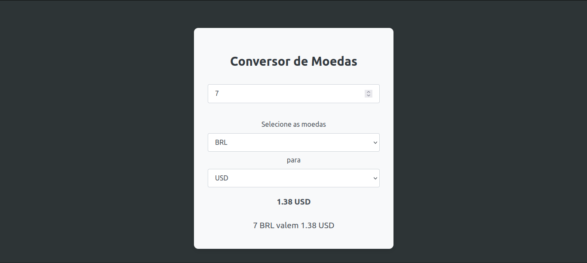

# Projeto 003 - Conversor de Moedas

Projeto de estudo desenvolvido no curso [20+ Projetos em React JS aprenda Redux, Bootstrap, APIs](https://www.udemy.com/share/109Ohk3@5QwjZu-ULUXpYc0iK6cqT_ayXruFz4eUoDF0DR83UmSjnZnVMPbTKYGZqYovrSSx/) da [Udemy](https://www.udemy.com/).

## Layout do projeto



## Dependências extras:
Para facilitar a conexão com api externa, e também fazer chamadas assíncronas, foi utilizado o pacote do [axios](https://www.npmjs.com/package/axios).

## Baixar as dependencias

- Com o node instalado execute o seguinte comando:

```bash
  npm install
```

## Executar a aplicação

- Agora subindo a aplicação:
```bash
  npm run dev
 ```
